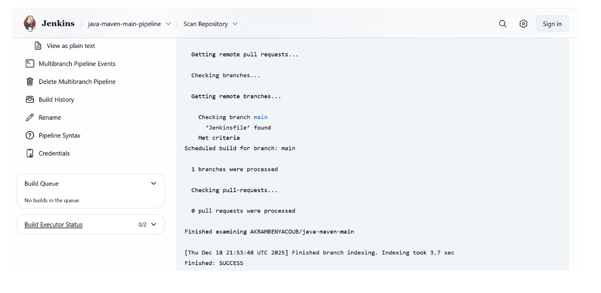
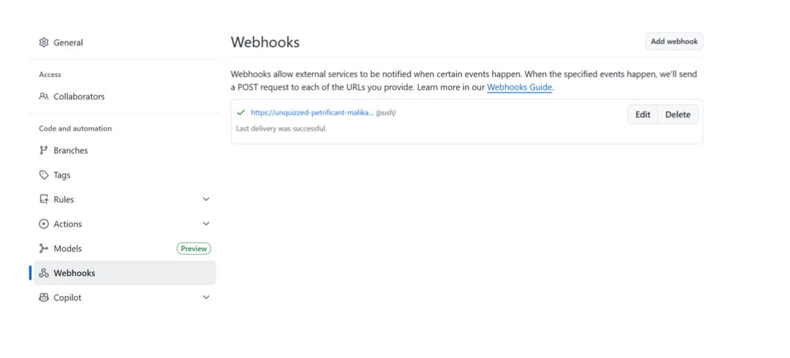
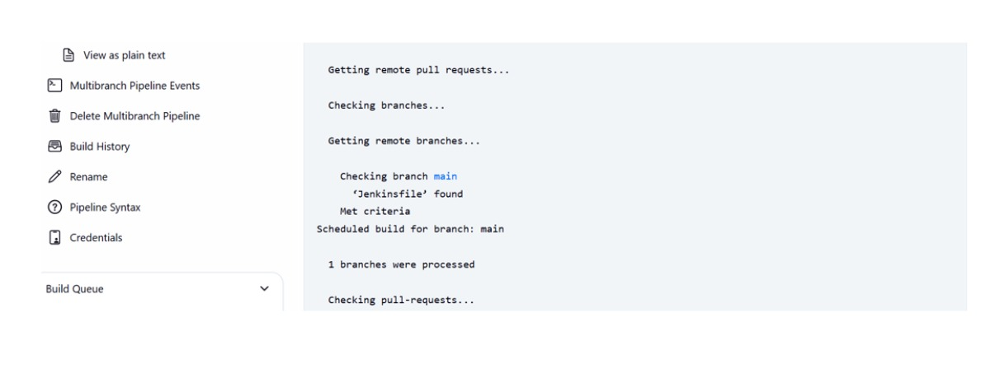

# TP Jenkins – MultiBranch Pipeline

**Réalisé par :** Ahlam Hmich  
**Module :** DevOps / CI-CD  
**Outil :** Jenkins  

## 🎯 Objectif du TP
Mettre en place un **MultiBranch Pipeline Jenkins** connecté à un dépôt GitHub
afin d’automatiser le build d’un projet Maven à chaque changement de branche.

## 🛠️ Contenu du projet
- Projet **Maven**
- Fichier **Jenkinsfile**
- Configuration **MultiBranch Pipeline**
- Intégration GitHub via **Webhook**

## 🔗 Configuration du Webhook GitHub
Le webhook a été configuré pour notifier Jenkins à chaque push.

## 🔍 Scan du dépôt par Jenkins
Jenkins détecte automatiquement les branches et le Jenkinsfile.

## ✅ Exécution du pipeline
Le pipeline MultiBranch s’exécute avec succès après l’indexation.

## ✔️ Résultat
- Jenkinsfile détecté automatiquement
- Pipeline exécuté avec succès
- Intégration GitHub ↔ Jenkins fonctionnelle

## 📌 Conclusion
Ce TP m’a permis de comprendre le fonctionnement des pipelines Jenkins
et l’automatisation CI/CD avec GitHub.
